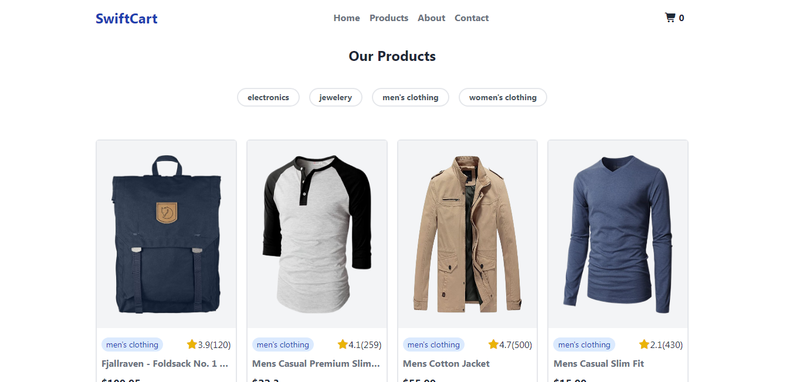

# SwiftCart E-Commerce Website

SwiftCart is a responsive e-commerce web application built with HTML, Tailwind CSS, Daisy-UI, and Vanilla JavaScript. This project dynamically fetches products and categories from an API and provides a clean, modern, and user-friendly shopping interface.

## Features

- Responsive Navbar with logo, menu, and cart icon
- Hero/Banner Section showcasing featured collections
- Dynamic Product Categories fetched from API
- Filter Products by Category with instant display
- Product Cards displaying image, title, price, category, and rating
- Add to Cart Button with cart count update
- Modal/Details Button to view product details
- Newsletter Section for user subscription
- Footer with basic information (can be expanded)

## Technologies Used

- HTML5
- Tailwind CSS
- Daisy-UI
- Vanilla JavaScript

## Live Demo:
https://mominulislam1234423.github.io/SwiftCart-E-Commerce-Website/

## Screenshot

## Answer to the questions:
1) What is the difference between null and undefined?
-  ভেরিয়েবলের কোন মান দেওয়া না থাকলে undefined দেখায়। আর মান নাই বা খালি বুঝাতে null ব্যবহার করা হয়।

2) What is the use of the map() function in JavaScript? How is it different from forEach()?
-  map() একটি Array এর প্রতিটি উপাদানের উপর চলে এবং নতুন একটি Array তৈরি করে। আর forEach() শুধু loop চালানোর জন্য ব্যবহার হয়।

3) What is the difference between == and ===?
-  == শুধু value তুলনা করে আর === value এবং মান দুইটাই তুলনা করে।

4) What is the significance of async/await in fetching API data?
-  Async/Await দিয়ে API call করতে সহজ হয় এবং call শেষ না হওয়া পর্যন্ত অপেক্ষা করে কোড। Error handling করা যায়।

5) Explain the concept of Scope in JavaScript (Global, Function, Block).
-  Global Scpoe: প্রোগ্রামের যে কোন জায়গা থেকে ব্যবহার করা যায়।
- Function Scope: শুধু ওই ফাংশনের ভিতরেই ব্যবহার করা যায়।
- Block Scope: ব্লকের ভিতরে ব্যবহার করা যায়।

